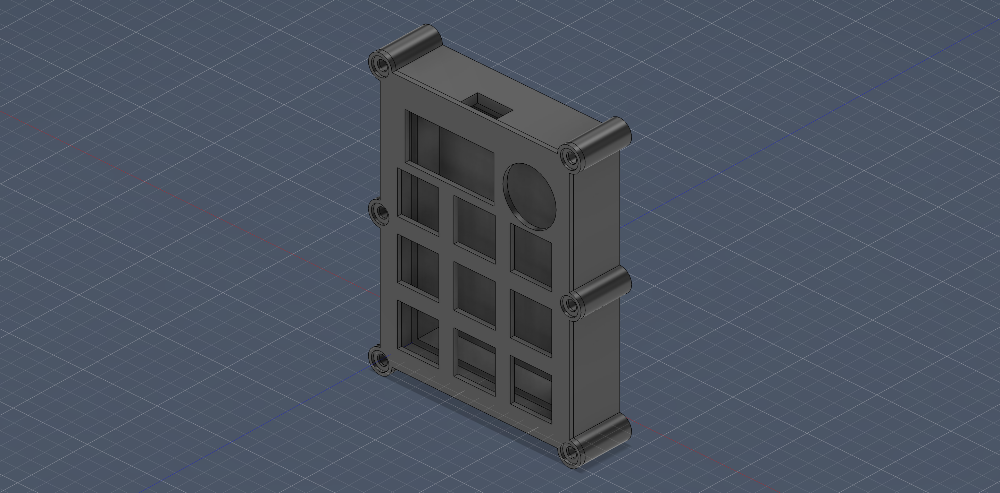
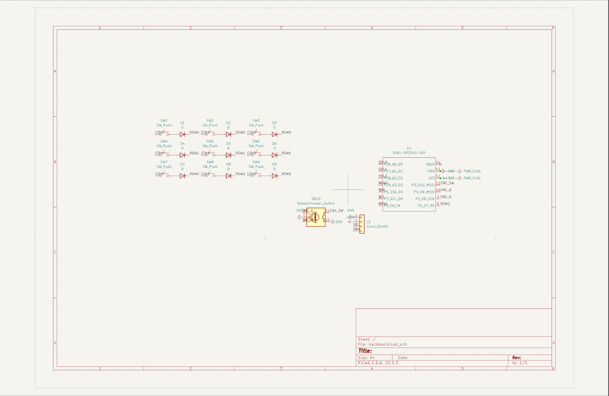
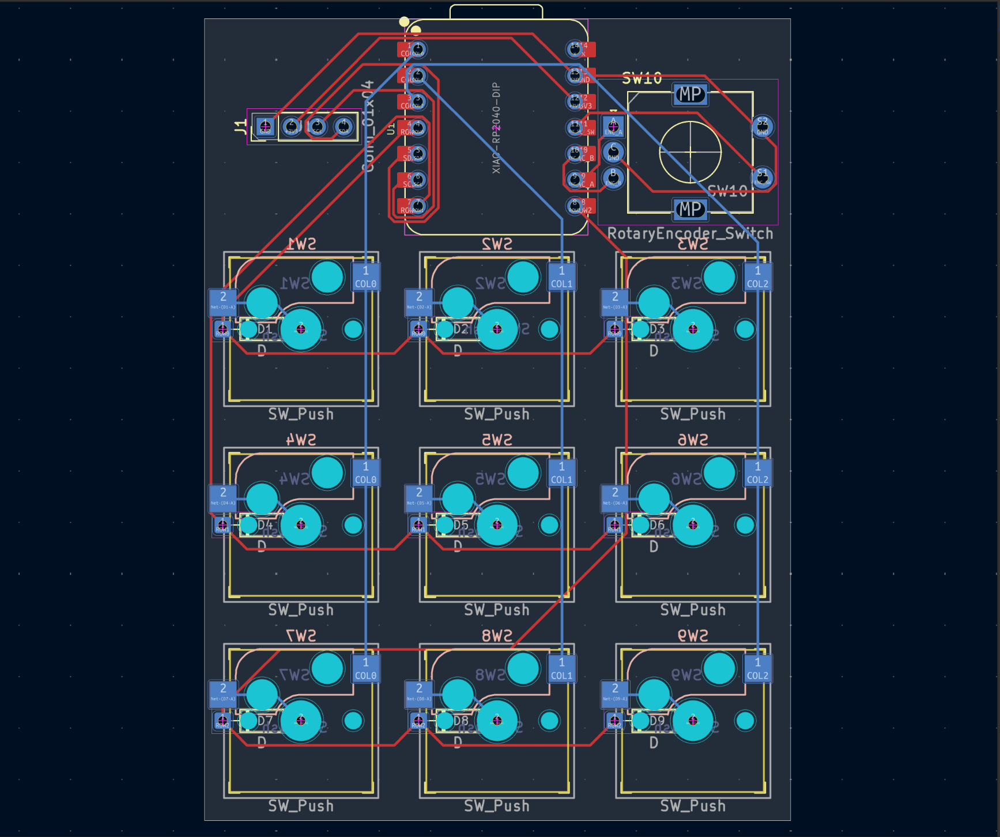
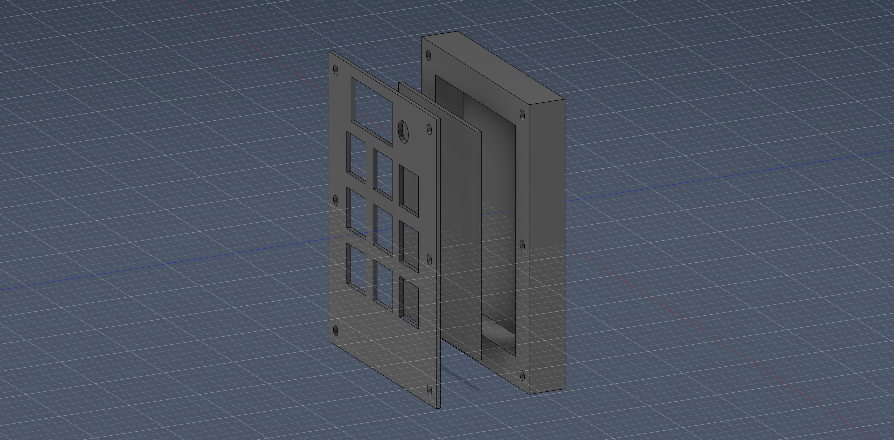

# Hackpad — 9-Key Macropad

A custom 9-key (3x3 matrix) macropad with a rotary encoder and a 1.3" OLED, built for the Hack Club Stardance Hackpad YSWS.

- **MCU:** Seeed XIAO RP2040
- **Layout:** 3x3 switch matrix + 1 rotary encoder (EC11) + 1.3" 128x64 OLED (I2C)
- **Firmware:** KMK (CircuitPython)
- **Case:** Sandwich-style, fully 3D printed

## Gallery

### Assembled model


### Schematic


### PCB layout


### Case (3D)


## Bill of Materials

| Component | Qty | Notes |
| --- | --- | --- |
| Seeed XIAO RP2040 | 1 | MCU (kit) |
| 1N4148 diode | 9 | matrix anti-ghosting (kit) |
| MX-style switch | 9 | (kit) |
| Kailh MX hotswap socket | 9 | self-sourced |
| EC11 rotary encoder | 1 | 20mm D-shaft (kit) |
| 1.3" 128x64 SH1106 OLED | 1 | I2C, self-sourced |
| 2.54mm 4-pin female header | 1 | OLED mount, self-sourced |
| DSA keycap | 9 | (kit) |
| M3x16 screw | 6 | (kit) |
| M3x5x4 heatset insert | 6 | (kit) |
| Custom PCB | 1 | JLCPCB, 2-layer, ~57x79mm |
| 3D printed case | 1 | top plate + bottom shell |

## Repository structure

```
.
├── README.md
├── CAD/
│   └── assembled-model.STEP
├── PCB/
│   ├── hackpad.kicad_pro
│   ├── hackpad.kicad_sch
│   └── hackpad.kicad_pcb
├── Firmware/
│   └── main.py
└── production/
    ├── gerbers.zip
    ├── Top.STEP
    ├── Bottom.STEP
    └── main.py
```

## Firmware

KMK (CircuitPython). Flash CircuitPython to the XIAO, copy the `kmk` library folder onto the CIRCUITPY drive, then drop `Firmware/main.py` on it.

Pin mapping (taken from the schematic):

- Columns: D0, D1, D2
- Rows: D3, D6, D7
- Encoder: A = D8, B = D9, SW = D10
- OLED I2C: SDA = D4, SCL = D5
- Diode orientation: COL2ROW

## Specs

- PCB: ~57x79mm, 2-layer (limit 100x100mm)
- Case: fully 3D printed (limit 200x200x100mm)
- Inputs: 9 keys + 1 encoder = 10 (limit 16)
- Tolerances: 0.2mm on mating surfaces, M3x5x4 heatset inserts (4.7mm holes), M3x16 screws (3.4mm clearance)

Note: I need a soldering iron — please include the $18 soldering iron grant.
